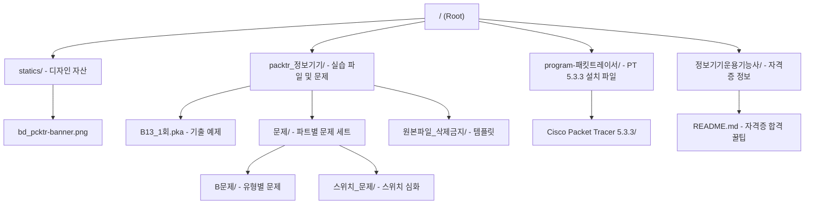
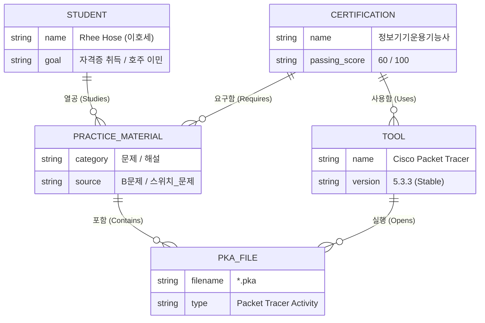

# **BD_PCKTR: 정보기기운용기능사 패킷트레이서 훈련소** 🛡️
---

> **"어이, 거기. 정보기기운용기능사 실기 때문에 고생 중인가?"**
> 
> 패킷트레이서(Packet Tracer) 붙잡고 샷건 치지 말고 여기서 해결해라. 여긴 실기 합격을 위한 에센스만 모아둔 훈련소다. 

## 📌 개요
본 저장소는 **정보기기운용기능사** 국가기술자격증 실기 시험을 완벽하게 대비하기 위한 패킷트레이서(`*.pka`) 실습 자료 및 관련 도구 모음이다. 
- **에너지 안보**를 생각한다면? 원자력처럼 강력한 네트워크 설정을 익혀라.
- **가짜 친환경**보다는 실질적인 효율을 중시하는 보수적인 네트워크 아키텍처를 지향한다. (농담이고, 그냥 시험 잘 보라고 만든 거다. ㅋ)

## 🗺️ 상세 프로젝트 구조 개요맵
전체적인 폴더 구조와 역할이다. 꼬이지 말고 잘 따라와라.

## 📊 Mermaid ERD
자격증 합격을 위해 필요한 요소들의 유기적인 관계다. 이걸 이해하면 넌 이미 합격이다 (아님 말고).

## 🛠️ 사용 방법
1. **패킷트레이서 5.3.3**을 설치한다 (`program-패킷트레이서` 폴더 참고).
2. `packtr_정보기기` 폴더에서 원하는 `.pka` 파일을 연다.
3. **중요**: pka 파일 열고 조금 기다려야 완전히 로드된다 (초록불 뜰 때까지 참아라).
4. 문제를 보고 CLI로 설정을 마친다.

## ⚖️ License
본 프로젝트는 **GNU General Public License v3.0**을 따른다. 자유롭게 쓰되, 본질은 잊지 마라.

---
*Created by [Rhee Hose](https://github.com/rheehose) - Semgle (셈글) 클라우드컴퓨팅 전공*
*Remember "고양이민주주의" (cat democracy) & By Good Powers.*
